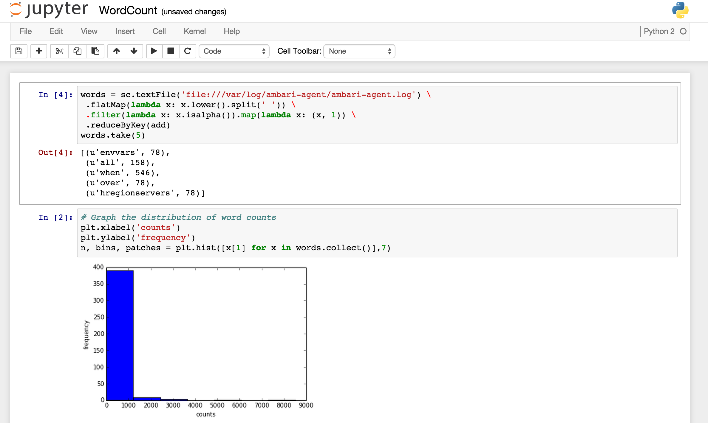

An Ambari service for Jupyter (IPython3) Notebooks. It comes with Python2.7 and many packages for working with data in Hadoop (pydoop, scikit-learn, pandas, numpy, scipy, etc.).

**Warning**: The Jupyter master service must be co-located on a node with the Spark Client (Jupyter Notebook depends on Spark Client libs in /usr/hdp/current/spark-client).

If you want to use the R kernel, install the [r-service](https://github.com/randerzander/r-service) first.

This stack deploys Python 2.7.9 as an altinstall. Make sure you backup any libraries already installed in /usr/local/lib/python2.7/site-packages.

To deploy, copy the entire directory into your Ambari stacks folder and restart Ambari:

**Note**: If using the HDP 2.2 Sandbox, stop the ambari service
```
sudo service ambari stop
```
and add a port forwarding rule for port 9999:


**Stack Install Directions:**
```
git clone https://github.com/randerzander/jupyter-service
sudo cp -r jupyter-service /var/lib/ambari-server/resources/stacks/HDP/2.2/services/
sudo service ambari-server restart
sudo service ambari-agent restart
```

Then you can click on 'Add Service' from the 'Actions' dropdown menu in the bottom left of the Ambari dashboard. When you've completed the install process, IPython Notebook will be available at your_server_host:9999



If you want to use your own Spark build, change the spark.home setting via Ambari to a directory accessible to jupyter.user (Default is 'jupyter'). Make sure your SPARK_HOME/conf/spark-defaults.conf includes your HDP version. For example:
```
sudo su jupyter
cd /home/jupyter
wget http://d3kbcqa49mib13.cloudfront.net/spark-1.3.1-bin-hadoop2.6.tgz
tar -xzvf spark-1.3.1-bin-hadoop2.6.tgz
echo "spark.driver.extraJavaOptions -Dhdp.version=2.2.0.0-2041" >> spark-1.3.1-bin-hadoop2.6/conf/spark-defaults.conf
echo "spark.yarn.am.extraJavaOptions -Dhdp.version=2.2.0.0-2041" >> spark-1.3.1-bin-hadoop2.6/conf/spark-defaults.conf
cp /etc/hive/conf/hive-site.xml spark-1.3.1-bin-hadoop2.6/conf/
# Disable ATS hooks & Tez
sed -i "s/org\.apache\.hadoop\.hive\.ql\.hooks\.ATSHook//g" spark-1.3.1-bin-hadoop2.6/conf/hive-site.xml
sed -i "s/<value>tez/<value>mr/g" spark-1.3.1-bin-hadoop2.6/conf/hive-site.xml
sed -ir "s|([0-9]+)s|\1|g" spark-1.3.1-bin-hadoop2.6/conf/hive-site.xml
```


A 'remove.sh' script is provided in the project root for convenience. It'll remove the service package from Ambari's resources dir, remove /home/jupyter, and Python2.7 bits. Please edit remove.sh to set your Ambari login and cluster name details.

Special thanks to [Ali Bajwa](https://github.com/abajwa-hw) and [Ofer Mendelevitch](https://github.com/ofermend) for the help with setup and build processes. Thanks also to [ddkaiser](https://github.com/ddkaiser) and [sakserv](https://github.com/sakserv) for help with regexes.
